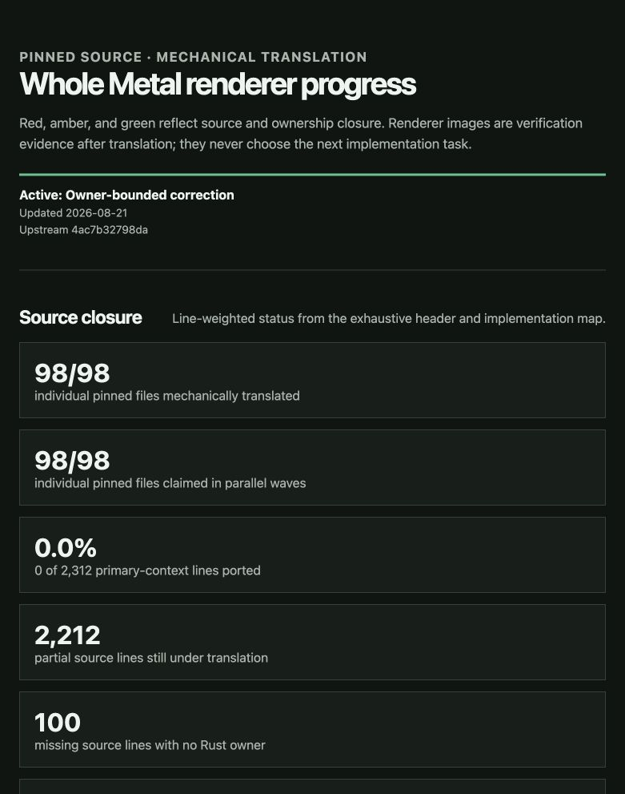

# Phase 3 global ownership/lifetime/ABI review

Date: 2026-08-21

Pinned upstream: `4ac7b32798da0482e441ef09304dc3b480ed3ee5`

Result: **RED**

This is the second independent adversarial pass over the complete 98-file
mechanical translation. Three fresh Sol contexts inspected the same disjoint
34/20/44-file partitions used by Phase 2. They made no edits and did not use
compiler output or behavioral fixtures to select work.

## Exact coverage

| Partition | Manifest ordinals | Source→target pairs | Result |
| --- | ---: | ---: | --- |
| ORE, GPU resource, and interleaved foundations | 1–14 | 34 | red |
| Generic renderer dependencies and implementation | 15–31 | 20 | red |
| Shader/build authority and native Metal owners | 32–35 | 44 | red |
| **Total** | **1–35** | **98** | **red** |

## Raw finding inventory

The partition reports contain 32 raw findings: 12 P0, 14 P1, and 6 P2.
The correction queue may combine source-adjacent causes, but every listed
observable ownership, lifetime, ABI, and unsafe-boundary defect remains an
acceptance requirement.

### P0

1. Native Metal `Retained<T>` and protocol owners are zero-sized markers with
   no pointer, retain, release, layout, or native lifetime.
2. The inert native implementation contains no executable command-buffer
   retain/transfer/commit/completion owner or ring-release callback.
3. `GradientContentKey::move_from` drops the retain it claims to transfer.
4. Movable `RenderContext` values contain children with raw back-pointers to
   the old context address.
5. Safe mapped-memory APIs accept arbitrary pointers and manufacture mutable
   references or perform writes without a caller-visible unsafe boundary.
6. `RenderTarget` final intrusive release casts an embedded counter address to
   its owner without a guaranteed offset-zero layout.
7. Safe sampler decoding transmutes arbitrary bytes into invalid Rust enums.
8. Generic intrusive refcount casts, raw dereferences, and Box reconstruction
   are exposed as safe operations without pointer-conversion or provenance
   constraints.
9. Mechanical GPU resources replace shared intrusive ownership with unique
   `Option<Box<T>>`, making the source owner graph and derived destruction
   unrepresentable.
10. Safe ORE context/bind-group/buffer/wrapper APIs store and dereference
    lifetime-untracked raw pointers.
11. Safe ORE upload methods permit native reads beyond byte-slice provenance.
12. Texture-view fallback performs an unadjusted derived cast without a Rust
    layout/allocation invariant.

### P1

1. Three disconnected background-compiler types defeat the source worker
   owner and join-on-destruction contract.
2. Safe copyable raw-pointer command-buffer tokens lose exact single-consume
   ARC transfer semantics.
3. Seven generated metallib byte owners and their static borrowed byte/count
   pairs are absent.
4. `RenderContext` drops backend and allocator roots before dependent logical
   flushes and arena allocations.
5. `DrawUniquePtr` loses its mandatory `releaseRefs()` destruction action.
6. Arena and linked-list roots are zero-sized markers while dependent pointers
   remain live.
7. Polymorphic unique owners become statically sized base objects, eliminating
   derived payload, dispatch, leases, and destruction.
8. Generic renderer roots omit intrusive-count and RTTI base state while still
   exposing `rcp` ownership.
9. GPU header declarations and implementation definitions use incompatible
   symbol/type/ABI shapes.
10. The Emscripten image delegate is a safe lifetime-free fat raw pointer rather
    than the source nullable non-owning machine pointer contract.
11. Most ORE inheritance surrogates place base fields first and therefore drop
    them before derived resource/native owners.
12. `RenderPassMetal` moves transfer base ownership the source deliberately
    leaves defaulted or unchanged.
13. Objective-C exception ownership/failure unwinding remains comments rather
    than executable recovery boundaries.
14. tvOS and visionOS configurations erase retained Metal owner types entirely.

### P2

1. Rust field declaration order contradicts source reverse-member destruction
   in native context/compiler, render canvas, and helper-ring owners.
2. C++ int-sized enums are narrowed to `u8` inside `repr(C)` records, while
   several native object fields are zero-sized markers.
3. Valid nil target-texture and adopted-image states cannot be expressed.
4. Generic `rcp<T>` does not preserve the source atomic cross-thread transfer
   contract.
5. Additional renderer records narrow C++ int enums and omit variants, changing
   layout and byte-copy behavior.
6. Several targets explicitly document the false premise that Rust drops
   fields in reverse declaration order.

## Phase disposition

Phase 3 is complete but red. Corrections are partitioned by complete source
owners, not by feature. Each correction partition must close both the Phase 2
source findings and Phase 3 ownership findings before the two independent
rereviews can issue final-clean receipts.

